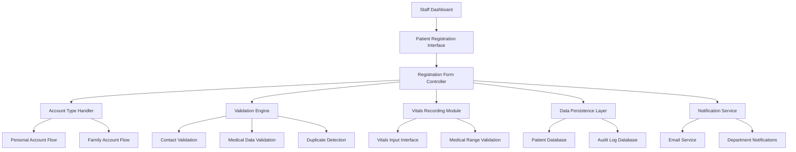

# Patient Registration System Design

## Overview

The Patient Registration System is a comprehensive web-based application that enables hospital staff to register new patients efficiently and securely. The system supports two distinct account types (personal and family), captures detailed patient information including contact details and next of kin, and integrates vitals recording capabilities. Built as a React component integrated into the existing T-Happy Hospital Management System, it provides a seamless user experience while maintaining data integrity and security.

## Architecture

### System Architecture



### Component Architecture

The system follows a modular React architecture with clear separation of concerns:

- **Registration Container**: Main orchestrator component
- **Account Type Selector**: Handles account type selection and routing
- **Personal Registration Form**: Manages individual patient registration
- **Family Registration Form**: Handles family account creation
- **Vitals Recording Component**: Captures and validates medical measurements
- **Validation Service**: Centralized validation logic
- **API Service**: Handles backend communication
- **Notification Service**: Manages email and system notifications

## Components and Interfaces

### Core Components

#### 1. PatientRegistrationContainer
**Purpose**: Main container component that orchestrates the entire registration flow
**Props**:
- `currentUser: StaffUser` - Authenticated staff member
- `onRegistrationComplete: (patient: Patient) => void` - Callback for successful registration
- `onCancel: () => void` - Callback for registration cancellation

**State Management**:
- Registration step tracking
- Form data persistence
- Validation state
- Loading and error states

#### 2. AccountTypeSelector
**Purpose**: Allows staff to choose between personal and family account types
**Props**:
- `onAccountTypeSelect: (type: 'personal' | 'family') => void`
- `selectedType?: 'personal' | 'family'`

#### 3. PersonalRegistrationForm
**Purpose**: Handles registration for individual patients
**Props**:
- `onSubmit: (data: PersonalAccountData) => void`
- `initialData?: Partial<PersonalAccountData>`
- `validationErrors?: ValidationErrors`

#### 4. FamilyRegistrationForm
**Purpose**: Manages family account creation with multiple members
**Props**:
- `onSubmit: (data: FamilyAccountData) => void`
- `initialData?: Partial<FamilyAccountData>`
- `validationErrors?: ValidationErrors`

#### 5. VitalsRecordingComponent
**Purpose**: Captures initial patient vitals during registration
**Props**:
- `patientId: string`
- `onVitalsRecorded: (vitals: VitalSigns) => void`
- `isRequired?: boolean`

### Data Models

#### Patient Data Model
```typescript
interface Patient {
  id: string;
  accountType: 'personal' | 'family';
  personalInfo: PersonalInfo;
  contactInfo: ContactInfo;
  nextOfKin: NextOfKin[];
  vitals?: VitalSigns;
  familyMembers?: FamilyMember[];
  createdAt: Date;
  createdBy: string;
  recordNumber: string;
}

interface PersonalInfo {
  firstName: string;
  lastName: string;
  middleName?: string;
  dateOfBirth?: Date;
  gender?: 'male' | 'female' | 'other';
}

interface ContactInfo {
  email: string;
  phoneNumber: string;
  address: Address;
}

interface Address {
  street: string;
  city: string;
  state: string;
  postalCode: string;
  country: string;
}

interface NextOfKin {
  id: string;
  fullName: string;
  relationship: string;
  phoneNumber: string;
  email?: string;
  isPrimary: boolean;
}

interface VitalSigns {
  bloodPressure: {
    systolic: number;
    diastolic: number;
  };
  heartRate: number;
  temperature: number;
  weight: number;
  height: number;
  recordedAt: Date;
  recordedBy: string;
}

interface FamilyMember {
  id: string;
  personalInfo: PersonalInfo;
  relationshipToPrimary: string;
  isAccountHolder: boolean;
}
```

#### Validation Models
```typescript
interface ValidationErrors {
  [fieldName: string]: string[];
}

interface ValidationRules {
  email: RegExp;
  phoneNumber: RegExp;
  postalCode: RegExp;
  vitalRanges: {
    bloodPressure: { min: number; max: number };
    heartRate: { min: number; max: number };
    temperature: { min: number; max: number };
    weight: { min: number; max: number };
    height: { min: number; max: number };
  };
}
```

### API Interfaces

#### Registration Endpoints
```typescript
// POST /api/patients
interface CreatePatientRequest {
  accountType: 'personal' | 'family';
  personalInfo: PersonalInfo;
  contactInfo: ContactInfo;
  nextOfKin: NextOfKin[];
  familyMembers?: FamilyMember[];
}

interface CreatePatientResponse {
  patient: Patient;
  recordNumber: string;
  welcomeEmailSent: boolean;
}

// POST /api/patients/:id/vitals
interface RecordVitalsRequest {
  vitals: VitalSigns;
}

// GET /api/patients/check-duplicate
interface DuplicateCheckRequest {
  firstName: string;
  lastName: string;
  email?: string;
  phoneNumber?: string;
}

interface DuplicateCheckResponse {
  isDuplicate: boolean;
  potentialMatches: Patient[];
}
```

## Data Models

### Database Schema Extensions

The system extends the existing patient database schema to support the new registration requirements:

```sql
-- Enhanced patients table
ALTER TABLE patients ADD COLUMN account_type VARCHAR(20) DEFAULT 'personal';
ALTER TABLE patients ADD COLUMN middle_name VARCHAR(100);
ALTER TABLE patients ADD COLUMN record_number VARCHAR(50) UNIQUE;
ALTER TABLE patients ADD COLUMN created_by INTEGER REFERENCES staff(id);

-- Next of kin table
CREATE TABLE next_of_kin (
  id INTEGER PRIMARY KEY AUTOINCREMENT,
  patient_id INTEGER REFERENCES patients(id) ON DELETE CASCADE,
  full_name VARCHAR(200) NOT NULL,
  relationship VARCHAR(100) NOT NULL,
  phone_number VARCHAR(20) NOT NULL,
  email VARCHAR(255),
  is_primary BOOLEAN DEFAULT FALSE,
  created_at TIMESTAMP DEFAULT CURRENT_TIMESTAMP
);

-- Family members table
CREATE TABLE family_members (
  id INTEGER PRIMARY KEY AUTOINCREMENT,
  primary_patient_id INTEGER REFERENCES patients(id) ON DELETE CASCADE,
  member_patient_id INTEGER REFERENCES patients(id) ON DELETE CASCADE,
  relationship_to_primary VARCHAR(100) NOT NULL,
  is_account_holder BOOLEAN DEFAULT FALSE,
  created_at TIMESTAMP DEFAULT CURRENT_TIMESTAMP
);

-- Enhanced vitals table
CREATE TABLE patient_vitals (
  id INTEGER PRIMARY KEY AUTOINCREMENT,
  patient_id INTEGER REFERENCES patients(id) ON DELETE CASCADE,
  systolic_bp INTEGER,
  diastolic_bp INTEGER,
  heart_rate INTEGER,
  temperature DECIMAL(4,1),
  weight DECIMAL(5,2),
  height DECIMAL(5,2),
  recorded_at TIMESTAMP DEFAULT CURRENT_TIMESTAMP,
  recorded_by INTEGER REFERENCES staff(id),
  notes TEXT
);

-- Registration audit log
CREATE TABLE registration_audit (
  id INTEGER PRIMARY KEY AUTOINCREMENT,
  patient_id INTEGER REFERENCES patients(id),
  action VARCHAR(100) NOT NULL,
  staff_id INTEGER REFERENCES staff(id),
  details TEXT,
  timestamp TIMESTAMP DEFAULT CURRENT_TIMESTAMP
);
```

## Correctness Properties

*A property is a characteristic or behavior that should hold true across all valid executions of a system-essentially, a formal statement about what the system should do. Properties serve as the bridge between human-readable specifications and machine-verifiable correctness guarantees.*

### Property 1: Account Type Form Adaptation
*For any* account type selection, the registration form should adapt its fields and workflow to match the selected account type
**Validates: Requirements 1.3**

### Property 2: Email Validation Consistency
*For any* email address input, the validation should accept valid email formats and reject invalid formats according to RFC standards
**Validates: Requirements 2.2, 4.1**

### Property 3: Phone Number Validation
*For any* phone number input, the validation should accept valid regional phone formats and reject invalid formats
**Validates: Requirements 2.3, 4.2**

### Property 4: Complete Address Requirement
*For any* address input, all required components (street, city, state, postal code) must be present for the address to be considered valid
**Validates: Requirements 2.4, 4.3**

### Property 5: Next of Kin Data Completeness
*For any* next of kin entry, the required fields (name, relationship, phone) must be present and valid
**Validates: Requirements 2.5, 5.1, 5.2, 5.3**

### Property 6: Form Submission Enablement
*For any* registration form state, submission should only be enabled when all required fields are completed and valid
**Validates: Requirements 2.6**

### Property 7: Family Member Profile Creation
*For any* completed family account registration, individual patient profiles should be created for each family member
**Validates: Requirements 3.6**

### Property 8: Multiple Family Members Support
*For any* family account, the system should support adding and managing multiple family members with their relationships
**Validates: Requirements 3.2, 3.3**

### Property 9: Primary Account Holder Designation
*For any* family account, exactly one person should be designated as the primary account holder
**Validates: Requirements 3.4**

### Property 10: Contact Information Validation Error Display
*For any* invalid contact information input, clear and specific error messages should be displayed to guide correction
**Validates: Requirements 4.4**

### Property 11: Multiple Next of Kin Support
*For any* patient registration, the system should support multiple next of kin contacts with one designated as primary
**Validates: Requirements 5.4, 5.5**

### Property 12: Vitals Range Validation
*For any* vital signs input, values should be validated against reasonable medical ranges and rejected if outside acceptable limits
**Validates: Requirements 6.5**

### Property 13: Vitals Timestamp Recording
*For any* vitals recording, the system should automatically timestamp the measurements with the current date and time
**Validates: Requirements 6.6**

### Property 14: Staff Authentication Verification
*For any* registration attempt, the system should verify staff authentication before allowing access to registration functions
**Validates: Requirements 7.1**

### Property 15: Registration Activity Logging
*For any* patient registration activity, the system should log the action with staff identification for audit purposes
**Validates: Requirements 7.3, 7.5**

### Property 16: Unauthorized Access Handling
*For any* unauthorized access attempt, the system should deny access and log the attempt for security monitoring
**Validates: Requirements 7.4**

### Property 17: Required Field Validation
*For any* form submission attempt, all required fields must be validated and submission prevented if any are missing or invalid
**Validates: Requirements 8.1, 8.5**

### Property 18: Duplicate Patient Detection
*For any* new patient registration, the system should check for potential duplicates using name and contact information
**Validates: Requirements 8.2**

### Property 19: Real-time Validation Feedback
*For any* form field interaction, validation feedback should be provided in real-time during form completion
**Validates: Requirements 8.3**

### Property 20: Validation Error Highlighting
*For any* validation error occurrence, the system should highlight the specific problematic fields and provide clear error messages
**Validates: Requirements 8.4**

### Property 21: Unique Patient Identifier Generation
*For any* completed patient registration, a unique patient identifier should be generated and assigned
**Validates: Requirements 9.1**

### Property 22: Patient Data Persistence
*For any* successful registration, all patient information should be stored in the hospital database immediately
**Validates: Requirements 9.2**

### Property 23: Patient Record Number Generation
*For any* new patient registration, a unique patient record number should be generated for reference purposes
**Validates: Requirements 9.3**

### Property 24: Immediate Search Availability
*For any* newly registered patient, the patient record should be immediately searchable in the hospital system
**Validates: Requirements 9.4**

### Property 25: Registration Confirmation Display
*For any* successful registration, a confirmation summary should be displayed to the staff member
**Validates: Requirements 9.5**

### Property 26: Welcome Email Delivery
*For any* completed patient registration, a welcome email should be sent to the patient's registered email address
**Validates: Requirements 10.1**

### Property 27: Welcome Email Content Completeness
*For any* welcome email sent, it should include the patient record number and basic account information
**Validates: Requirements 10.2, 10.3**

### Property 28: Email Delivery Failure Handling
*For any* email delivery failure, the system should log the failure and notify relevant staff members
**Validates: Requirements 10.4**

### Property 29: Welcome Email Resend Capability
*For any* patient record, staff should be able to resend welcome emails when needed
**Validates: Requirements 10.5**

### Property 30: Form Field Labels and Placeholders
*For any* form field in the registration interface, clear labels and helpful placeholder text should be provided
**Validates: Requirements 11.3**

### Property 31: Keyboard Navigation and Accessibility
*For any* form interaction, keyboard navigation and accessibility features should be supported for inclusive access
**Validates: Requirements 11.4**

### Property 32: Progress Indicator Display
*For any* multi-step registration process, progress indicators should be displayed to show completion status
**Validates: Requirements 11.5**

### Property 33: Auto-save Progress Protection
*For any* form data entry, progress should be auto-saved to prevent data loss during registration
**Validates: Requirements 11.6**

### Property 34: Real-time Interface Updates
*For any* new patient registration, patient lists should be updated in real-time across all connected interfaces
**Validates: Requirements 12.3**

### Property 35: Department Notification Delivery
*For any* new patient registration, relevant hospital departments should be notified of the new patient
**Validates: Requirements 12.5**

## Error Handling

### Validation Error Management
- **Client-side Validation**: Real-time validation with immediate feedback
- **Server-side Validation**: Comprehensive validation before data persistence
- **Error Message Standardization**: Consistent, user-friendly error messages
- **Field-level Error Display**: Specific error highlighting for problematic fields

### Network Error Handling
- **Connection Failure**: Graceful degradation with offline data preservation
- **Timeout Handling**: Automatic retry mechanisms with user notification
- **Server Error Recovery**: Clear error messages with suggested actions

### Data Integrity Protection
- **Transaction Management**: Atomic operations for multi-table updates
- **Rollback Mechanisms**: Automatic rollback on partial failure
- **Duplicate Prevention**: Pre-submission duplicate checking
- **Audit Trail Maintenance**: Comprehensive logging of all operations

## Testing Strategy

### Dual Testing Approach
The system employs both unit testing and property-based testing for comprehensive coverage:

**Unit Tests**: Verify specific examples, edge cases, and error conditions
- Registration form component behavior
- Validation rule enforcement
- API endpoint responses
- User interface interactions

**Property Tests**: Verify universal properties across all inputs
- Form validation consistency across all input combinations
- Data persistence integrity for all registration types
- Email delivery reliability across all patient data
- Security enforcement across all access attempts

### Property-Based Testing Configuration
- **Testing Framework**: fast-check for JavaScript property-based testing
- **Test Iterations**: Minimum 100 iterations per property test
- **Test Tagging**: Each property test references its design document property
- **Tag Format**: **Feature: patient-registration-system, Property {number}: {property_text}**

### Testing Coverage Areas
1. **Form Validation Properties**: Email, phone, address validation across all inputs
2. **Data Persistence Properties**: Registration data integrity across all account types
3. **Security Properties**: Authentication and authorization across all access scenarios
4. **Integration Properties**: Real-time updates and notifications across all operations
5. **User Experience Properties**: Form behavior and feedback across all interactions

### Test Data Generation
- **Patient Data Generators**: Realistic patient information for comprehensive testing
- **Validation Test Cases**: Valid and invalid inputs for all form fields
- **Family Structure Generators**: Various family configurations for family account testing
- **Vitals Data Generators**: Medical measurement data within and outside valid ranges